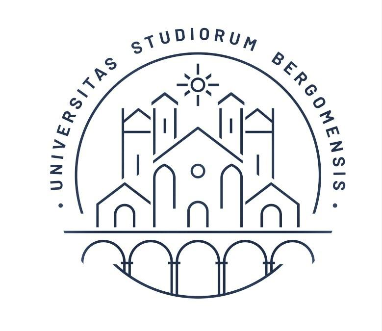

# Studio della tolleranza alle radiazioni ionizzanti di MOSFET in tecnologia $28nm$

## Tesi triennale d'Ingegneria Informatica

### Autori:

* Nicola Cattaneo
* Emilio Meroni
### Divisione Cartelle
* **Tesi** Cartella contenente il materiale per la produzione della tesi
* **Script Statiche** Cartella contentente tutti gli script per le analisi delle misure statiche.
* **Script Rumore** Cartella contentente tutti gli script per le analisi delle misure di rumore.
* **Misure Statiche** Cartella contenente le misure statiche
* **Misure Statiche** Cartella contenente le misure di rumore
* **Altri Script** Script di riferimento

